<p align="right">
<a href="README.md"></a>
<a href="README.bg.md"></a>
</p>

<picture>
  <source media="(max-width: 600px)" srcset="docs/assets/00-hero-bg-mobile.svg">
  
</picture>

**readme-studio** превръща един JSON файл в анимиран двуезичен README за GitHub профил. Включва въвеждащ блок с
орбитираща светлина, карти на проекти, решетки с технологии, времеви линии, акцентни числа, бутони за контакт и
разделители. Всяко изображение е самостоятелен SVG, който работи в защитения преглед на GitHub. При разглеждане не се
зарежда нищо външно и не се изпълнява JavaScript.

**[Вижте демо профила →](examples/README.bg.md)** · **[English →](README.md)**

<picture>
  <source media="(max-width: 600px)" srcset="docs/assets/01-highlights-bg-mobile.svg">
  
</picture>

## Защо изглежда еднакво навсякъде

GitHub показва изображенията в README през прокси, което премахва скриптове, уеб шрифтове и външни ресурси. Повечето
анимирани README файлове се чупят от това или зависят от чужд сървър, който рано или късно спира. readme-studio е
изграден около тези ограничения:

| Проблем | Какво прави readme-studio |
| --- | --- |
| Уеб шрифтовете са блокирани | Заглавията се **превръщат в SVG контури** с шрифта [Unbounded](https://github.com/googlefonts/unbounded) (латиница + кирилица). Текстът остава в `<title>`/`<desc>` и в alt. |
| Външните джаджи спират | **Нула мрежови заявки.** Всички икони, градиенти и анимации са вътре във файла. |
| Движението може да пречи | Цялата анимация е в `@media (prefers-reduced-motion: no-preference)`. Ако изключите движението в системата, всяко изображение показва завършена статична композиция. |
| Текстът на телефон е дребен | Всеки компонент има **мобилен вариант** от 600 px, който се сменя чрез `<picture>`. |
| Един език не стига | Всеки текст може да е `{"en": "...", "bg": "..."}`. Получавате `README.md` и `README.<език>.md` с превключвател. |
| Счупените изображения изглеждат непрофесионално | `python -m studio lint` проверява за липсващи файлове, скриптове, външни връзки, тежки SVG файлове и анимации извън заявката за намалено движение. |

## Бърз старт

<picture>
  <source media="(max-width: 600px)" srcset="docs/assets/02-timeline-bg-mobile.svg">
  
</picture>

### ⚡ Най-бързо: една команда, без код

**macOS / Linux**: поставете това в Terminal:

```bash
curl -fsSL https://raw.githubusercontent.com/yyakowvw/readme-studio/main/install.sh | bash
```

**Windows**: [изтеглете ZIP файла](https://github.com/yyakowvw/readme-studio/archive/refs/heads/main.zip), разархивирайте го и щракнете два пъти върху **`setup.bat`**.
**macOS без Terminal**: изтеглете ZIP файла и щракнете два пъти върху **`Setup Profile.command`**.

Настройката ви задава няколко въпроса (на български или английски): име, заглавие, проекти, технологии, контакти и тема. След това:

1. създава всички анимирани изображения и вашия `README.md` (и `README.bg.md`, ако искате два езика);
2. отваря преглед в браузъра;
3. публикува в `github.com/<вие>/<вие>`, ако потвърдите (с GitHub CLI, ако е инсталиран, иначе с `git`);
4. добавя GitHub Action, така че по-късните промени в `profile.json` обновяват профила сами.

За промени по-късно пуснете същата команда отново. Предишните отговори са попълнени.

### Вариант А: GitHub Action (без нищо на компютъра)

1. В профилното си хранилище (`<потребител>/<потребител>`) добавете [`examples/profile.json`](examples/profile.json) като `profile.json` и го редактирайте.
2. Добавете `.github/workflows/profile.yml`:

```yaml
name: Build profile
on:
  push:
    paths: [profile.json]
  workflow_dispatch:
permissions:
  contents: write
jobs:
  build:
    runs-on: ubuntu-latest
    steps:
      - uses: actions/checkout@v4
      - uses: yyakowvw/readme-studio@main
        with:
          config: profile.json
```

При всяка промяна на `profile.json` изображенията и README се обновяват автоматично и се записват обратно в хранилището.

### Вариант Б: на вашия компютър

```bash
git clone https://github.com/yyakowvw/readme-studio
cd readme-studio
pip install -r requirements.txt          # само fontTools
cp examples/profile.json ~/my-profile/profile.json
python -m studio build ~/my-profile/profile.json
```

Резултат: `assets/studio/*.svg`, `README.md` и по един `README.<език>.md` за всеки допълнителен език, до вашия конфигурационен файл.

## Теми

`"theme": "aurora" | "sunset" | "ocean" | "matrix"`. Всеки цвят може да се смени с `"colors": {"accents": [...]}`.

| aurora | sunset |
| --- | --- |
|  |  |
|  |  |
| **ocean** | **matrix** |
|  |  |
|  |  |

## Компоненти

`sections` е подреден списък. README следва същия ред.

| `type` | Какво рисува | Основни полета |
| --- | --- | --- |
| `hero` | Име, заглавие в контури, орбити, перспективен под, етикети | `kicker`, `headline` (1–2 реда), `lines`, `chips` (≤ 4) |
| `heading` | Заглавие на секция с градиент и движеща се линия | `kicker`, `title`, `subtitle`, `anchor` |
| `projects` | По една карта с връзка за всеки проект, с анимиран мотив | `items[]`: `name`, `kind`, `description`, `tags`, `motif` (`scan`, `network`, `tree`, `hex`, `page`), `url`, `markdown` |
| `stack` | Решетка с технологии и икони в цветовете на марката | `title`, `items`: имена на икони (`"react"`), заглавия (`"Node.js"`) или `{"name", "icon", "color"}` |
| `timeline` | 2–6 стъпки по светеща пътека | `kicker`, `steps[]`: `title`, `text` |
| `highlights` | 1–4 големи числа | `items[]`: `value`, `label` |
| `divider` | Разделител: `waves`, `beads`, `circuit`, `constellation`, `sunrise` | `motif` |
| `contact` | Бутони: `mail`, `web`, `linkedin` или всяка вградена икона (`discord`, `github`, `telegram`, `instagram`, `x`, `youtube`…) | `buttons[]`: `kind`, `value`, `href`, `label`, `color` |
| `footer` | Блестящи думи и мото | `words`, `tagline` |
| `markdown` | Ваш Markdown между изображенията | `text` |

<picture>
  <source media="(max-width: 600px)" srcset="docs/assets/03-stack-bg-mobile.svg">
  
</picture>

`python -m studio themes` показва темите. Пълният списък с икони е в [`studio/data/icons.json`](studio/data/icons.json).
Непознатите имена получават плочка с инициали.

## Само истина

Профилът е първото впечатление, затова нека е вярно. В конфигурацията слагайте само реални проекти, числа и умения.
Демо профилът е измислен човек: сменете всяка дума, преди да публикувате.

## Разработка

```bash
python -m unittest discover tests     # 17 теста
python scripts/showcase.py            # обновява docs/ и examples/
```

CI пуска тестовете при всяка промяна и спира, ако записаните SVG файлове не могат да се получат отново от конфигурациите.
Приносът е добре дошъл, вижте [CONTRIBUTING.md](CONTRIBUTING.md).

<picture>
  <source media="(max-width: 600px)" srcset="docs/assets/05-footer-bg-mobile.svg">
  
</picture>

<sub>Код: MIT © Yavor Yakow ([@yyakowvw](https://github.com/yyakowvw)). Шрифтът Unbounded е под лиценза SIL Open Font License 1.1 (`fonts/unbounded/OFL.txt`).
Иконите на марки са от [Simple Icons](https://simpleicons.org) (CC0 1.0) и остават търговски марки на собствениците си.</sub>
