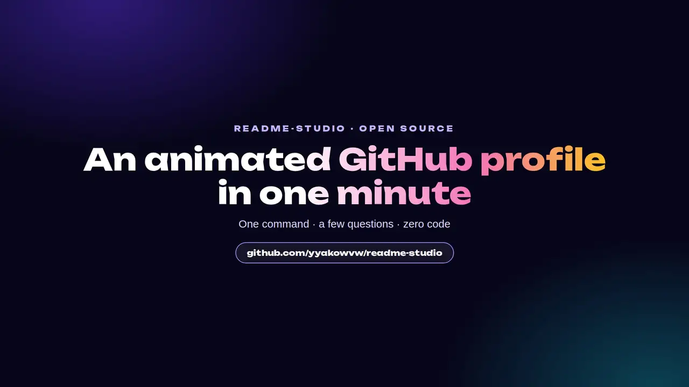

<p align="right">
<a href="README.md"></a>
<a href="README.bg.md"></a>
</p>

<picture>
  <source media="(max-width: 600px)" srcset="docs/assets/00-hero-en-mobile.svg">
  
</picture>

**readme-studio** turns one JSON file into an animated, bilingual GitHub profile README: a hero with orbiting light,
project cards, technology grids, timelines, highlight numbers, contact buttons and section dividers. Every visual is
a self-contained SVG that works inside GitHub's image sanitiser. Nothing loads at view time and no JavaScript runs.

**[See the demo profile →](examples/README.md)** · **[Български →](README.bg.md)**

<picture>
  <source media="(max-width: 600px)" srcset="docs/assets/01-highlights-en-mobile.svg">
  
</picture>



<p align="center"><sub>▶ <b>55-second demo</b>: one command, a few answers, a finished animated profile.</sub></p>

## Quick start

<picture>
  <source media="(max-width: 600px)" srcset="docs/assets/02-timeline-en-mobile.svg">
  
</picture>

### ⚡ Fastest: one command, no code

**macOS / Linux**: paste this in Terminal:

```bash
curl -fsSL https://raw.githubusercontent.com/yyakowvw/readme-studio/main/install.sh | bash
```

**Windows**: [download the ZIP](https://github.com/yyakowvw/readme-studio/archive/refs/heads/main.zip), unzip it and double-click **`setup.bat`**.
**macOS without Terminal**: download the ZIP and double-click **`Setup Profile.command`**.

The setup asks you a few questions (in English or Bulgarian): your name, headline, projects, technologies, contacts and theme. Then it:

1. builds every animated image and your `README.md` (plus `README.bg.md` if you want two languages);
2. opens a preview in your browser;
3. publishes to `github.com/<you>/<you>` when you say yes (uses the GitHub CLI if installed, otherwise `git`);
4. adds a GitHub Action, so later edits to `profile.json` rebuild the profile on their own.

To change anything later, run the same command again. Your previous answers are pre-filled.

### Option A: GitHub Action (no local setup)

1. In your profile repository (`<username>/<username>`), add [`examples/profile.json`](examples/profile.json) as `profile.json` and edit it.
2. Add `.github/workflows/profile.yml`:

```yaml
name: Build profile
on:
  push:
    paths: [profile.json]
  workflow_dispatch:
permissions:
  contents: write
jobs:
  build:
    runs-on: ubuntu-latest
    steps:
      - uses: actions/checkout@v4
      - uses: yyakowvw/readme-studio@main
        with:
          config: profile.json
```

Every push to `profile.json` rebuilds the SVGs and your README and commits them back.

### Option B: on your computer

```bash
git clone https://github.com/yyakowvw/readme-studio
cd readme-studio
pip install -r requirements.txt          # only fontTools
cp examples/profile.json ~/my-profile/profile.json
python -m studio build ~/my-profile/profile.json
```

Output: `assets/studio/*.svg`, `README.md` and one `README.<lang>.md` per extra language, next to your config.

## 🎨 Make it yours

The setup never forces anything on you:

- **Every text is editable.** Each question shows a suggestion: press Enter to keep it, type your own text, or type `-` to leave that element out completely.
- **Choose what appears.** Switch sections on and off: intro banner, about me, projects, technologies, numbers, how I work, contact buttons, closing banner, dividers and the language switch. The intro banner's decorations (planets, glowing grid, stars, light sweep, colour glow, light bar) can be switched off one by one.
- **Any colour combination.** Pick one of 18 themes, combine it with one of 8 backgrounds, type your own colours by name (`pink, cyan, gold`) or hex (`#FACC15`), or roll random palettes until one feels right.

Run the same command again whenever you want to change something. Every answer you gave is pre-filled.

## Themes

18 themes, 8 backgrounds (`midnight`, `black`, `navy`, `forest`, `wine`, `plum`, `slate`, `espresso`) and any colours you like:

```json
"theme": "neon",
"colors": {"background": "navy", "accents": ["pink", "cyan", "#FACC15"]}
```

| **aurora** | **sunset** | **ocean** |
| --- | --- | --- |
|  |  |  |
| **matrix** | **neon** | **candy** |
|  |  |  |
| **rose** | **forest** | **ice** |
|  |  |  |
| **ember** | **gold** | **mono** |
|  |  |  |
| **cyber** | **lavender** | **coral** |
|  |  |  |
| **galaxy** | **mint** | **retro** |
|  |  |  |

## Components

`sections` is an ordered list. The README follows the same order.

| `type` | What it draws | Main fields |
| --- | --- | --- |
| `hero` | Name, outlined headline, orbit system, perspective floor, chips | `kicker`, `headline` (1–2 lines), `lines`, `chips` (≤ 4) |
| `heading` | Section title with a gradient and a sweeping underline | `kicker`, `title`, `subtitle`, `anchor` |
| `projects` | One linked card per project with an animated motif | `items[]`: `name`, `kind`, `description`, `tags`, `motif` (`scan`, `network`, `tree`, `hex`, `page`), `url`, `markdown` |
| `stack` | Technology grid with brand-coloured icons | `title`, `items`: icon slugs (`"react"`), names (`"Node.js"`) or `{"name", "icon", "color"}` |
| `timeline` | 2–6 steps along a glowing path | `kicker`, `steps[]`: `title`, `text` |
| `highlights` | 1–4 big numbers | `items[]`: `value`, `label` |
| `divider` | Chapter break: `waves`, `beads`, `circuit`, `constellation`, `sunrise` | `motif` |
| `contact` | Pill buttons: `mail`, `web`, `linkedin`, or any bundled icon (`discord`, `github`, `telegram`, `instagram`, `x`, `youtube`…) | `buttons[]`: `kind`, `value`, `href`, `label`, `color` |
| `footer` | Shimmering word chips and a tagline | `words`, `tagline` |
| `markdown` | Your own Markdown between visuals | `text` |

<picture>
  <source media="(max-width: 600px)" srcset="docs/assets/03-stack-en-mobile.svg">
  
</picture>

Run `python -m studio themes` to list themes. The full icon list is in [`studio/data/icons.json`](studio/data/icons.json).
Unknown names fall back to a monogram tile.

## Keep it honest

A profile is a first impression, so make it a true one. Put real projects, real numbers and real skills in the config.
The demo profile is a fictional person, so replace every word of it before you publish.

## Development

```bash
python -m unittest discover tests     # 20 tests
python scripts/showcase.py            # rebuild docs/ and examples/
```

CI runs the tests on every push and fails if the committed SVGs are not reproducible from the configs.
Contributions are welcome. See [CONTRIBUTING.md](CONTRIBUTING.md).

<picture>
  <source media="(max-width: 600px)" srcset="docs/assets/05-footer-en-mobile.svg">
  
</picture>

<sub>Code: MIT © Yavor Yakow ([@yyakowvw](https://github.com/yyakowvw)). The Unbounded typeface is licensed under the SIL Open Font License 1.1 (`fonts/unbounded/OFL.txt`).
Brand icons come from [Simple Icons](https://simpleicons.org) (CC0 1.0) and remain trademarks of their owners.</sub>
