

<picture>
  <source media="(max-width: 600px)" srcset="assets/studio/00-hero-bg-mobile.svg">
  
</picture>

### 👋 Здравейте, аз съм Алекс

Създавам бързи и достъпни уеб продукти и инструментите около тях. Всяко изображение на тази страница е чист SVG — без JavaScript и без външни услуги.

<picture>
  <source media="(max-width: 600px)" srcset="assets/studio/02-divider-bg-mobile.svg">
  
</picture>

<picture>
  <source media="(max-width: 600px)" srcset="assets/studio/03-heading-bg-mobile.svg">
  
</picture>

<a href="https://github.com/yyakowvw/readme-studio">
<picture>
  <source media="(max-width: 600px)" srcset="assets/studio/04-projects-1-bg-mobile.svg">
  
</picture>
</a>

<picture>
  <source media="(max-width: 600px)" srcset="assets/studio/04-projects-2-bg-mobile.svg">
  
</picture>

<picture>
  <source media="(max-width: 600px)" srcset="assets/studio/04-projects-3-bg-mobile.svg">
  
</picture>

<picture>
  <source media="(max-width: 600px)" srcset="assets/studio/05-divider-bg-mobile.svg">
  
</picture>

<picture>
  <source media="(max-width: 600px)" srcset="assets/studio/06-highlights-bg-mobile.svg">
  
</picture>

<picture>
  <source media="(max-width: 600px)" srcset="assets/studio/07-heading-bg-mobile.svg">
  
</picture>

<picture>
  <source media="(max-width: 600px)" srcset="assets/studio/08-stack-bg-mobile.svg">
  
</picture>

<picture>
  <source media="(max-width: 600px)" srcset="assets/studio/09-divider-bg-mobile.svg">
  
</picture>

<picture>
  <source media="(max-width: 600px)" srcset="assets/studio/10-heading-bg-mobile.svg">
  
</picture>

<picture>
  <source media="(max-width: 600px)" srcset="assets/studio/11-timeline-bg-mobile.svg">
  
</picture>

<picture>
  <source media="(max-width: 600px)" srcset="assets/studio/12-divider-bg-mobile.svg">
  
</picture>

<picture>
  <source media="(max-width: 600px)" srcset="assets/studio/13-heading-bg-mobile.svg">
  
</picture>

<picture>
  <source media="(max-width: 600px)" srcset="assets/studio/15-footer-bg-mobile.svg">
  
</picture>
