

<picture>
  <source media="(max-width: 600px)" srcset="assets/studio/00-hero-en-mobile.svg">
  
</picture>

### 👋 Hi, I'm Alex

I build fast, accessible web products and the tooling around them. Every visual on this page is pure SVG — no JavaScript, no external services.

<picture>
  <source media="(max-width: 600px)" srcset="assets/studio/02-divider-en-mobile.svg">
  
</picture>

<picture>
  <source media="(max-width: 600px)" srcset="assets/studio/03-heading-en-mobile.svg">
  
</picture>

<a href="https://github.com/yyakowvw/readme-studio">
<picture>
  <source media="(max-width: 600px)" srcset="assets/studio/04-projects-1-en-mobile.svg">
  
</picture>
</a>

<picture>
  <source media="(max-width: 600px)" srcset="assets/studio/04-projects-2-en-mobile.svg">
  
</picture>

<picture>
  <source media="(max-width: 600px)" srcset="assets/studio/04-projects-3-en-mobile.svg">
  
</picture>

<picture>
  <source media="(max-width: 600px)" srcset="assets/studio/05-divider-en-mobile.svg">
  
</picture>

<picture>
  <source media="(max-width: 600px)" srcset="assets/studio/06-highlights-en-mobile.svg">
  
</picture>

<picture>
  <source media="(max-width: 600px)" srcset="assets/studio/07-heading-en-mobile.svg">
  
</picture>

<picture>
  <source media="(max-width: 600px)" srcset="assets/studio/08-stack-en-mobile.svg">
  
</picture>

<picture>
  <source media="(max-width: 600px)" srcset="assets/studio/09-divider-en-mobile.svg">
  
</picture>

<picture>
  <source media="(max-width: 600px)" srcset="assets/studio/10-heading-en-mobile.svg">
  
</picture>

<picture>
  <source media="(max-width: 600px)" srcset="assets/studio/11-timeline-en-mobile.svg">
  
</picture>

<picture>
  <source media="(max-width: 600px)" srcset="assets/studio/12-divider-en-mobile.svg">
  
</picture>

<picture>
  <source media="(max-width: 600px)" srcset="assets/studio/13-heading-en-mobile.svg">
  
</picture>

<picture>
  <source media="(max-width: 600px)" srcset="assets/studio/15-footer-en-mobile.svg">
  
</picture>
